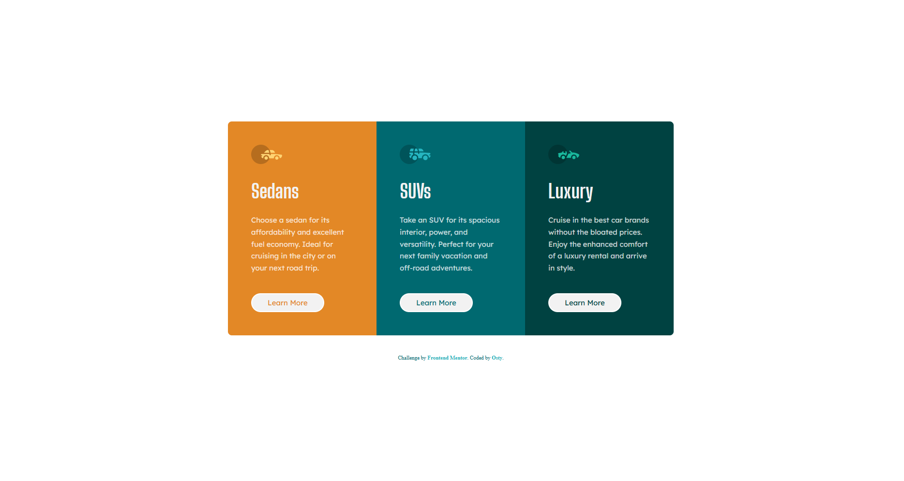

# Frontend Mentor - 3-column preview card component solution

This is a solution to the [3-column preview card component challenge on Frontend Mentor](https://frontendmentor.io). Frontend Mentor challenges help you improve your coding skills by building realistic projects.

## Table of contents
- [Overview](#overview)
  - [The challenge](#the-challenge)
  - [Screenshot](#screenshot)
  - [Links](#links)
- [My process](#my-process)
  - [Built with](#built-with)
  - [What I learned & Key Challenges](#what-i-learned--key-challenges)
  - [Project Estimation & Retrospective](#project-estimation--retrospective)
- [Author](#author)

## Overview

### The challenge
Users should be able to:
- View the optimal layout depending on their device's screen size (Desktop, Tablet 768px, and Mobile 320px).
- See interactive hover and click/active states for all "Learn More" buttons on the page.
- Experience a fully fluid responsive transition from a single-column mobile view to an advanced multi-dimensional CSS Grid layout.

### Screenshot
  
*Fig 1. Final look of my responsive 3-column preview card component using production-ready SCSS compilation and dynamic custom properties layout mixing.*

### Links
- Solution URL: [Solution Link](https://github.com/Osty-trainee/3-column-preview-card-component)
- Live Site URL: [Live Site Link](https://osty-trainee.github.io/3-column-preview-card-component/)

## My process

### Built with
- Semantic HTML5 markup (`<main>` grid wrapper and independent `<article>` components for enhanced SEO and screen-reader accessibility).
- BEM (Block-Element-Modifier) methodology ensuring zero style leakage, modular nesting, and clean component isolation inside SCSS rules.
- CSS Custom Properties (`:root`) acting as a single source of truth for color design tokens and layout utility variables.
- Combined layout systems: **CSS Grid** for the structural multi-column grid architecture and **Flexbox** inside cards for exact content stretching fallbacks.
- Modular Sass/SCSS architecture dividing code blocks into dedicated files (`_fonts`, `_variables`, `_reset`, `_card`, `main.scss`).
- Clean Git project state management tracking both the source `scss/` architecture and the final compiled distribution `css/` asset folders.

### What I learned & Key Challenges

This challenge seemed straightforward but provided valuable lessons on cross-browser rendering quirks, font loading rules, and CSS inheritance:

1. **The Font Weight & Faux-Bold Render Bug:** 
   During development, the main description paragraph text (`.card__text`) appeared heavily pixelated and overly thick. I discovered that setting `font-weight: 100;` on the custom *Lexend Deca* font triggered a "faux-bold" browser rendering fallback because the font file only shipped with a standard `400` (Regular) weight index. Correcting the constraint to an explicit `font-weight: 400;` combined with a soft transparency layer perfectly restored the design's elegant typography look:
   ```scss
   &__text {
       font-family: \$ff-body;
       font-weight: 400; /* Forces the browser to load the true regular weight asset */
       color: hsla(0, 0%, 100%, 0.75); /* Smooth opacity to soften visual bulk */
   }
   ```

2. **The Hover Target Scope Obstacle:**
   At first, adding the hover effect inside the wrong SCSS nesting level caused the entire card background to flash white when mouse cursors passed over the block, completely blinding out the text elements. I resolved this by isolating the pseudo-class rule strictly within the block-modifier of the anchor button element (`&__btn`):
   ```scss
   &__btn {
       // Button default styles here...
       transition: background-color 0.2s ease, color 0.2s ease;

       &:hover {
           background-color: transparent; // Button shifts into ghost mode safely
           color: var(--white) !important;
           cursor: pointer;
       }
   }
   ```

3. **Aligning Asymmetric Layout Footers:**
   Integrating the global Frontend Mentor copyright footer into a layout that heavily relies on absolute viewport centering (`min-height: 100vh`) caused layout overlap. I solved this cleanly by refactoring the `body` into a vertical column Flex axis and assigning a dynamic spacing layout (`justify-content: space-around;`) to distribute space naturally around the cards block and the attribution element.

## Project Estimation & Retrospective
- **Initial Estimation:** 2 to 3 hours.
- **Actual Time Taken:** ~ 3 hours (including deep design systems debugging and BEM architecture auditing).

**Retrospective Summary:**  
While building a simple card module looks rapid on paper, maintaining precise vertical baseline alignment for the buttons across multi-paragraph text variations requires clean CSS layout strategies. Utilizing a robust combination of CSS Grid columns along with internal card `flex-direction: column` rules successfully prevented uneven button alignments without resorting to ugly absolute position rules.

## Author

- GitHub - [@Osty-trainee](https://github.com/Osty-trainee)
- Frontend Mentor - [@Osty-trainee](https://www.frontendmentor.io/profile/Osty-trainee)
